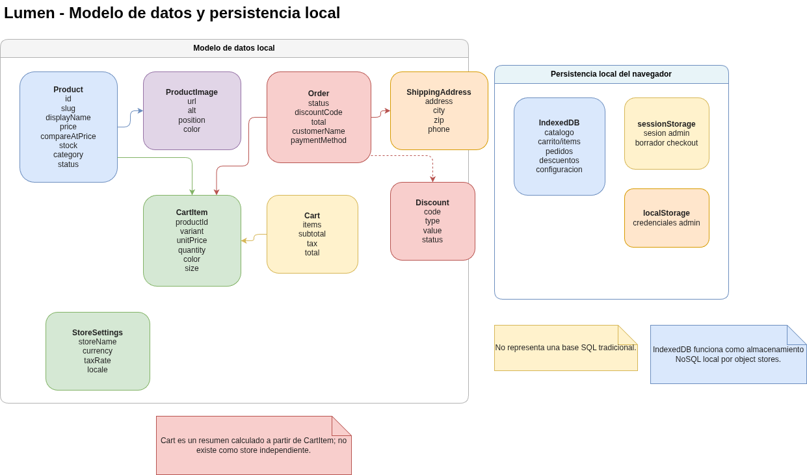
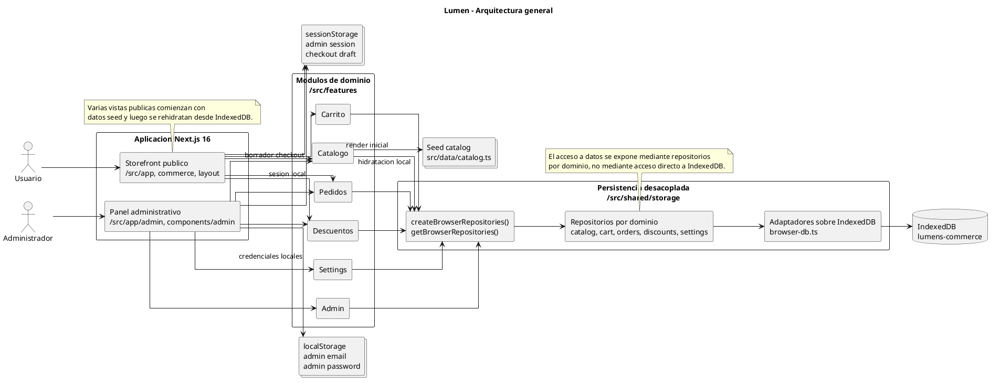
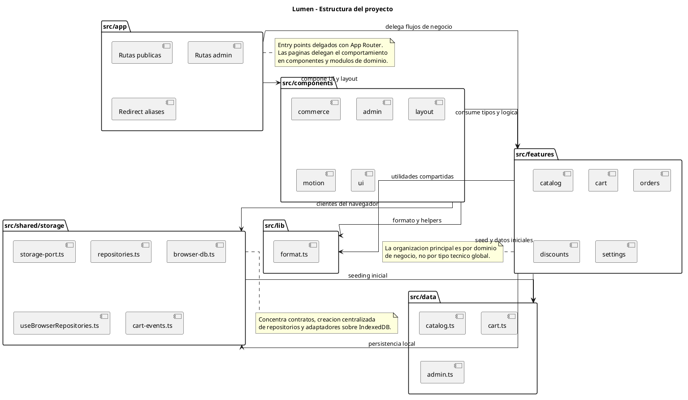

# Lumen

## Descripcion general

Lumen es una demo funcional de e-commerce en espanol construida con Next.js 16. Reune en un mismo proyecto un storefront publico, un flujo completo de compra y un panel administrativo local para operar catalogo, descuentos, ventas y configuracion.

El proyecto esta pensado como una pieza de portafolio y como una base tecnica para explorar flujos comerciales sin depender de un backend real. La persistencia vive en el navegador mediante IndexedDB, `sessionStorage` y `localStorage`, lo que permite simular una operacion coherente de tienda y administracion dentro de una sola aplicacion.

Aunque hoy funciona como demo desplegable, la estructura separa rutas, componentes, modulos de negocio y persistencia de una forma que facilita evolucionar hacia una version con servicios remotos mas adelante.

## Proposito del proyecto

Lumen busca demostrar un flujo comercial end to end dentro de una aplicacion frontend moderna. El proyecto cubre navegacion de catalogo, detalle de producto, carrito, checkout y confirmacion de compra, al tiempo que expone una experiencia administrativa para gestionar productos, descuentos, pedidos y ajustes de tienda.

Tambien sirve para mostrar decisiones de organizacion tecnica utiles en una demo realista: modulos por dominio en `features`, persistencia local desacoplada mediante repositorios, componentes reutilizables y una separacion clara entre la experiencia publica y el panel administrativo.

## Funcionalidades principales

### Storefront

- `/` inicio con destacados y acceso a ofertas activas.
- `/categorias` vista editorial por categorias con rails horizontales.
- `/categorias/[slug]` listado filtrable por categoria.
- `/novedades` seleccion destacada del catalogo.
- `/ofertas` productos con descuento visible a partir de `price` y `compareAtPrice`.
- `/productos/[slug]` detalle de producto con variantes por color, talla y agregado al carrito.
- `/carrito` resumen editable del pedido.
- `/pago` checkout con datos de contacto, direccion, metodo de pago y codigo de descuento.
- `/pago/exito` confirmacion final con identificador del pedido.

### Panel administrativo

- `/admin/login` acceso administrativo local para el navegador actual.
- `/admin` dashboard con metricas de ventas, inventario y actividad reciente.
- `/admin/productos` gestion de productos y descuentos.
- `/admin/sales` consulta de pedidos y actualizacion de estado operativo.
- `/admin/config` configuracion general de tienda y credenciales locales.
- Credenciales demo configurables desde el panel de configuracion si se desea cambiar el acceso local.

### Persistencia local

- `IndexedDB` para productos, carrito, pedidos, descuentos y configuracion de tienda.
- `sessionStorage` para la sesion administrativa local y el borrador temporal del checkout.
- `localStorage` para correo y contrasena administrativa configurados localmente.

## Credenciales demo

El acceso administrativo es local y esta orientado a demostracion en el navegador actual.

- Correo: `admin@lumen.local`
- Contrasena: `lumen-demo`

Estas credenciales siguen confirmadas en el codigo y pueden cambiarse desde `/admin/config`.

## Stack tecnologico

- Next.js 16
- React 19
- TypeScript
- Tailwind CSS 4
- Motion
- IndexedDB
- pnpm

## Arquitectura general

Lumen usa App Router para separar las rutas publicas y administrativas dentro de `src/app`. Las paginas funcionan como entrypoints delgados y delegan la mayor parte del comportamiento en componentes y modulos de dominio.

La logica del negocio se organiza en `src/features`, con modulos para catalogo, carrito, pedidos, descuentos, configuracion y administracion. Los componentes reutilizables viven en `src/components`, mientras que `src/shared/storage` concentra la capa de persistencia local y la creacion de repositorios del navegador.

Hay una decision importante en el flujo de datos: varias vistas publicas arrancan con datos seed desde `src/data/catalog.ts`, y luego algunos clientes se hidratan con el estado almacenado en IndexedDB. Eso permite tener una primera carga estable y, al mismo tiempo, reflejar cambios locales hechos desde el panel administrativo en la experiencia interactiva del navegador actual.

## Decisiones tecnicas

- La persistencia local esta encapsulada en una capa propia sobre IndexedDB dentro de `src/shared/storage`, en lugar de repartir acceso directo a la API nativa por toda la aplicacion.
- El acceso a datos esta desacoplado mediante repositorios por dominio para catalogo, carrito, pedidos, descuentos y configuracion.
- La organizacion principal del codigo sigue modulos de negocio en `src/features`, lo que mantiene juntos tipos, logica y flujos de cada area.
- El storefront publico y el panel administrativo comparten parte del modelo de datos, pero se mantienen separados por rutas, componentes y flujos de interfaz.
- El catalogo combina un seed inicial en `src/data/catalog.ts` con persistencia local en navegador para la operacion interactiva.
- La creacion de repositorios del navegador esta centralizada mediante `createBrowserRepositories()` y `getBrowserRepositories()`.
- La estructura actual deja preparada una migracion futura hacia persistencia remota sin rehacer por completo la aplicacion.

## Estructura del proyecto

```txt
src/
├── app/                 # Rutas y entrypoints de Next.js
├── components/          # Componentes visuales reutilizables
├── data/                # Datos seed para la primera carga
├── features/            # Modulos de negocio por dominio
├── lib/                 # Utilidades compartidas
└── shared/storage/      # Persistencia local y repositorios de navegador
```

- `src/app`: define las rutas publicas y administrativas, junto con algunos aliases en ingles que redirigen a las rutas canonicas en espanol.
- `src/components`: contiene piezas reutilizables para storefront, panel administrativo, layout, animacion y UI compartida.
- `src/data`: guarda el catalogo seed y datos auxiliares usados para la primera carga y el seeding inicial del almacenamiento local.
- `src/features`: agrupa la logica del negocio por dominio, incluyendo tipos, pricing, checkout, metricas administrativas y reglas de consulta.
- `src/lib`: concentra utilidades pequenas de formato usadas por varias vistas.
- `src/shared/storage`: implementa la persistencia local, la apertura de IndexedDB, los stores, los helpers de acceso y los repositorios del navegador.

## Modelo de datos

Las entidades principales confirmadas en el codigo son estas:

- `Product`: producto del catalogo con `id`, `slug`, `displayName`, `description`, `price`, `compareAtPrice`, `stock`, `category`, `colors`, `sizes`, `images`, `status`, fechas y metadatos visuales.
- `ProductImage`: imagen asociada a un producto con `url`, `alt`, `position` y color opcional.
- `CartItem`: item persistido en carrito con producto, variante, cantidad, precio unitario, color, talla e imagen.
- `Cart`: resumen calculado del carrito con `items`, `subtotal`, `tax`, `total` y `updatedAt`.
- `Order`: pedido generado en checkout con articulos, montos, codigo de descuento, datos del cliente, direccion de envio, metodo de pago y estado.
- `Discount`: descuento por codigo con tipo (`percentage` o `fixed`), valor, estado y fechas opcionales.
- `StoreSettings`: configuracion local de tienda con nombre, moneda, tasa de impuesto, locale y fecha de actualizacion.
- Sesion administrativa local: estado efimero guardado en `sessionStorage` para controlar el acceso al panel en el navegador actual.

## Diagramas

La documentacion tecnica del proyecto incluye tres diagramas que resumen el modelo de datos local, la arquitectura general y la estructura del codigo. A continuacion se muestran las versiones renderizadas junto con una explicacion breve de cada una.

### Modelo de datos y persistencia local



Este diagrama separa las entidades principales del dominio de los mecanismos de persistencia del navegador. En el centro aparecen `Product`, `CartItem`, `Cart`, `Order`, `Discount` y `StoreSettings`; a un lado se muestra el contexto de almacenamiento local con `IndexedDB`, `sessionStorage` y `localStorage`.

- `IndexedDB` funciona aqui como almacenamiento NoSQL del navegador.
- Sus `object stores` son contenedores locales de registros por clave, mas cercanos a colecciones de objetos que a tablas con joins.

### Arquitectura general



El flujo principal va de actores a aplicacion, de aplicacion a modulos de dominio, y de ahi a la capa de persistencia local. La idea importante es que las pantallas no acceden directamente a IndexedDB: pasan por `src/features` y por la capa de repositorios y adaptadores de `src/shared/storage`, mientras `src/data/catalog.ts` actua como seed inicial para el catalogo.

### Estructura del proyecto



Este diagrama muestra la organizacion de la aplicacion por responsabilidades. `src/app` define rutas y entrypoints, `src/components` concentra la UI reutilizable, `src/features` actua como nucleo del dominio, `src/shared/storage` centraliza la persistencia local, `src/data` aporta el seed inicial y `src/lib` agrupa utilidades compartidas.

## Estado del proyecto

Lumen se encuentra en un estado de demo funcional de e-commerce con persistencia local. El sistema permite recorrer el flujo publico de compra, administrar productos y descuentos, registrar pedidos y operar una configuracion de tienda desde el navegador.

No es una arquitectura final para una tienda con datos compartidos entre usuarios o dispositivos. Su valor actual esta en demostrar experiencia de producto, organizacion tecnica y flujos comerciales completos dentro de una aplicacion desplegable y autocontenida.

## Ejecucion local

```bash
pnpm install
pnpm dev
```

Aplicacion disponible en `http://localhost:3000`.

### Scripts disponibles

```bash
pnpm dev
pnpm build
pnpm start
pnpm lint
pnpm typecheck
```

## Despliegue

Lumen puede desplegarse sin friccion en Vercel porque es una aplicacion Next.js sin dependencias de infraestructura externa para su funcionamiento actual. El resultado es util como demo publica, presentacion tecnica o pieza de portafolio.

La limitacion deliberada es que la persistencia sigue siendo local al navegador. Eso significa que productos editados desde el panel, pedidos creados en checkout, descuentos y configuracion no se comparten entre usuarios ni entre dispositivos. Cada navegador mantiene su propio estado.

Si el proyecto evolucionara hacia un escenario productivo real, el siguiente paso natural seria reemplazar la persistencia local por una base de datos remota y una capa de servicios o backend que permita autenticacion real, administracion compartida y consistencia global de datos.
